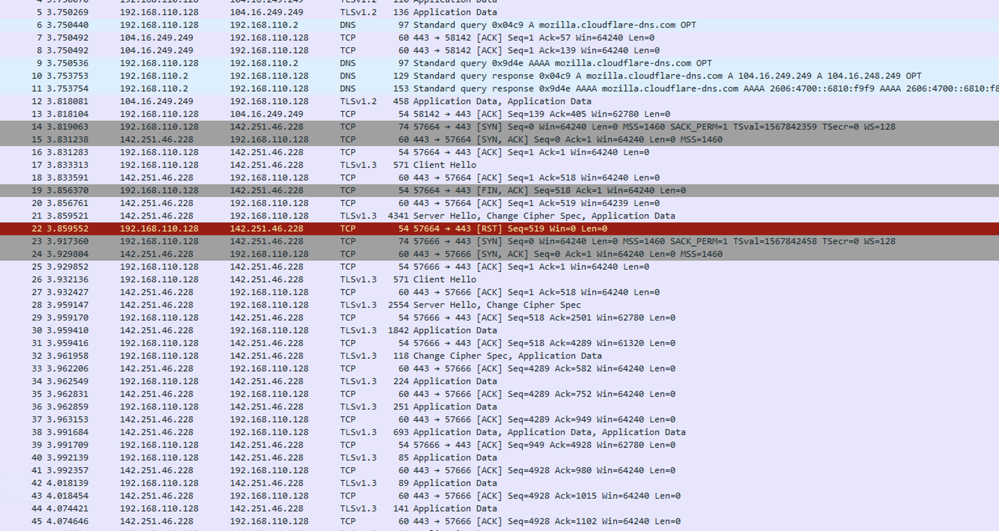
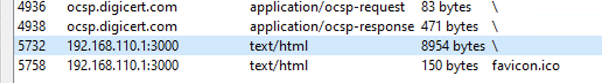
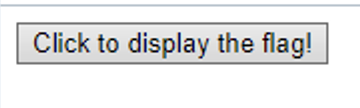
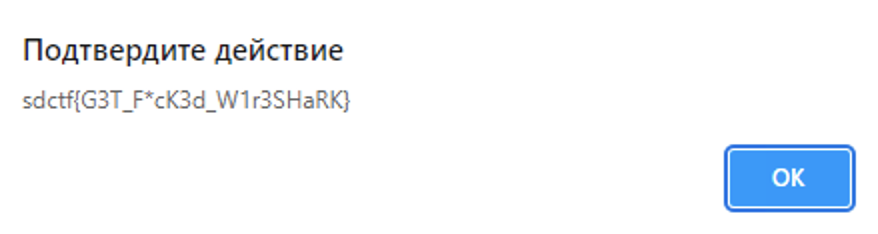

# Flag Trafficker
### FORENSICS - Easy

We've sniffed the traffic of somebody suspected to be looking up flags online! Unfortunately, just searching for the flag format in their traffic doesn't appear to be working...can you find the leaked flag?

By KNOXDEV

## Solution

I opened the file in WireShark and looked through the contents. Most of the contents were encrypted TLS1.3, which are not easy to decrypt.

I decided to check available files from HTTP, and there was something suspicious:

I extract this [file](file.html) and opened it in the browser. Press the button and get the flag!

#### Flag: sdctf{G3T_F*cK3d_W1r3SHaRK}
