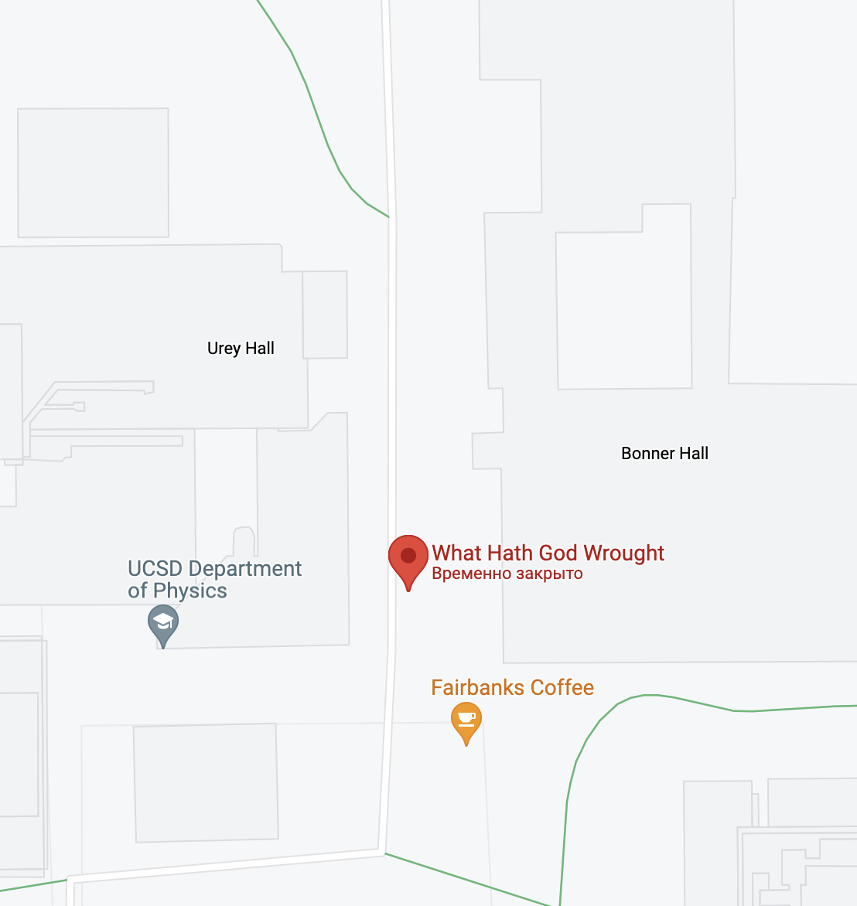

# Samuel
### OSINT - Medium

Where is this? [Video link](https://www.youtube.com/watch?v=fDGVF1fK1cA)

Flag format: sdctf{latitude,longitude} using decimal degrees and 3 decimal places rounded toward zero (Ex. 4.1239 → 4.123, -4.0009 → -4.000)

Example: If the location was [this](https://goo.gl/maps/TnhzfxXKg9TDYDfR9), the flag would be sdctf{38.889,-77.035}

## Solution

We know that this CTF is from San Diego, and the video looks like some kind of beacon that shows Morse codes. Let's google it!

One of the first results is this [article](https://www.sandiegouniontribune.com/entertainment/visual-arts/sd-et-visual-morse-code-20181203-story.html). This sculpture seems the correct one, so lets find the coordinates!

I bit more googling, and I found [a tourist guide](https://stuartcollection.ucsd.edu/map/index.html) with the map of art exhibitions. And here is the sculpture on [Google Maps](https://goo.gl/maps/NtCHuDkoNRQ9CkG19):

#### Flag: sdctf{32.875,-117.240}
